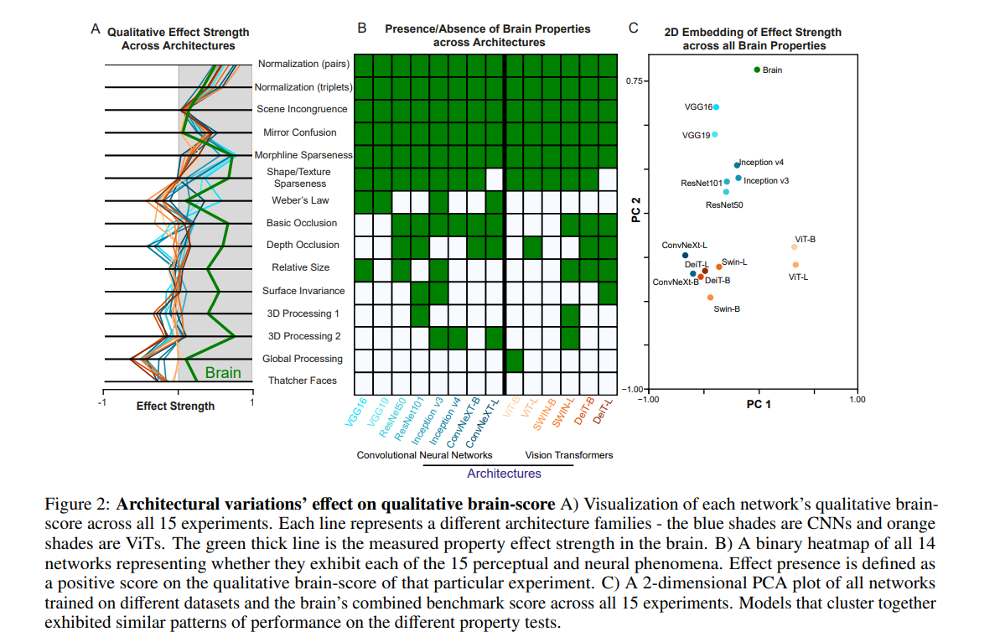
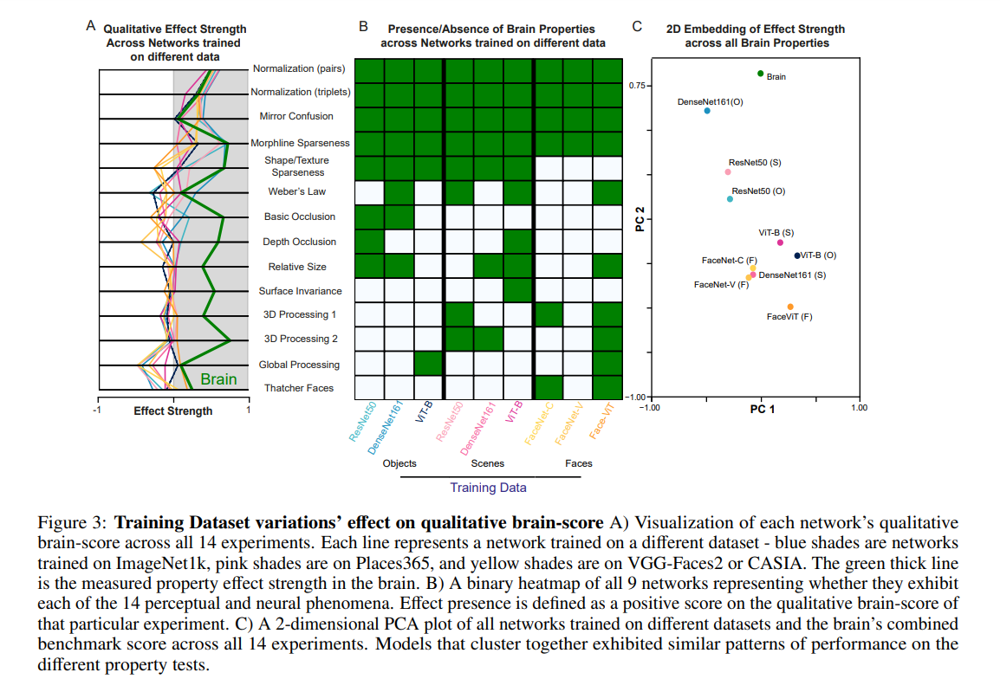
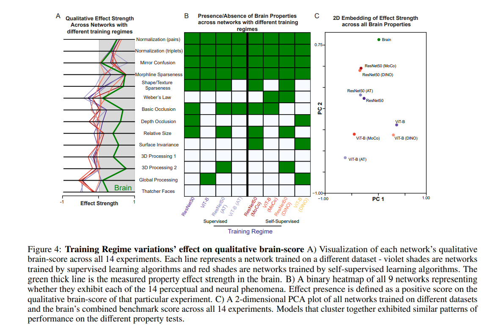

> Topic: \
> Towards a real conversation between vision in brains and machines
> 
> Speaker: \
> SP Arun, Centre for Neuroscience, Indian Institute of Science, Bangalore

I think most of his talk is based on this paper: [Brain-like emergent properties in deep networks: Impact of network architecture, datasets and training](https://arxiv.org/pdf/2411.16326)

# Central Philosophy, Efforts and Findings

- Despite the rapid pace at which deep networks are improving on standardized vision benchmarks, they are still outperformed
by humans on real-world vision tasks. This paradoxical lack of generalization could be addressed by making deep networks more brain-like. Although several benchmarks have compared the ability of deep networks to predict brain responses to natural images, they do not capture subtle but important brainlike emergent properties. 
- To resolve this issue, we report several well-known perceptual and neural emergent properties that can be tested on deep networks. 
- Our main findings are as follows.
    1. network architecture (among Architecture, Datasets, Training Scheme) had the strongest impact on brain-like properties compared to dataset and training regime variations.
    2. networks varied widely in their alignment to the brain with no single network outperforming all others.
- Taken together, our results complement existing benchmarks by revealing brain-like properties that are either emergent or lacking in state-of-the-art deep networks.

### Markovec's Paradox

- Tasks that are difficult for humans, such as mathematical calculations, data analysis, and playing chess, are relatively easy for machines to perform.
- Tasks that are easy for humans, such as motor or social skills, are difficult for machines to replicate. For example, it's difficult for machines to recognize faces or move through an environment.

### How to understand the Brain Functions

Its not sufficient to just test input stimuli and behavioural outputs and make hypothesis based on that. We need to see deeper and use measurable parameters like MRI etc. So, we also experiment on monkeys since they are our closest relatives.

### The Hard Problem of AI

- What is 'A' ?
- What is 'I' (consciousness)?

### How does the Brain solves Vision Problems?

- Neuroscience studies reveal that there are a huge number of regions in the brain dedicated specially to solve vision.

### How do we quantify brain responses?

Take for example: Identifying how hard it is to find the odd one out in a picture (say a camouflaged tiger in bush)
- For AI, we might measure the similarity scores between the embeddings of various image components.
- For Human, we might measure the time taken to repond. This time will be proportional to how hard it is for the brain to identify the odd one out.

And then we can make a plot distances of various objects with respect to each other in both of AI space versus Human space.
This will give us insights about the how AI and Brain encode the visual informations and whether some brain-like properties/biases are present in AI models or not. (SPOILER: Some are and some aren't)

### Are some process-modelings of brains obeyed my AI as well?

Take for example: Reading distorted characters (say Captcha)
- Conside two tasks (1) reading single letter (2) reading a string of letters. Let:
    - L = time taken to recognize a given letter/character without distortion
    - D = magnitude of distortion
    - TL = time taken to recognise the letter/character with distortion
    - TS = time taken to recognize the string made up of some characters

- For Task-1 we can have two models:
    - Multiplicative Model: TL = (S + D)
    - Additive Model: TL = (S * D)
- For Task-2 we can again have two models:
    - Multiplicative Model: TS = PIE(TL for each character)
    - Additive Model: TS = SIGMA(TL for each character)

It is found that:
1. Brain obeys Multiplicative Model for Task-1 but Additive Model for Task-2. These verifications are based on reponse time (common measure of brain processes in neruroscience and cognitive psychology)
2. Seems like these rules are also found in some DNNs (even though the engineers were unaware of it, yet the architecture, training strategy, dataset and learning objectives might have forced the network to learn these modelings implicitely) 
3. There is correlation between "Presence of these rules" in the network and its "Performance"

# Brain-like properties in DNNs

For each DNN models, training scheme and dataset the authors tested a total of 15 brain-like properties, as summarized below and detailed in Supplementary Section of the paper:

1. Object Normalization-pairs: The neural response to two objects is the average of the response to the individual objects.
2. Object Normalization-triplets: The neural response to three objects is the average of the response to the individual objects.
3. Scene Incongruence: Object categorization is more accurate when objects are presented in congruent compared to incongruent scenes.
4. Mirror Confusion: Images reflected about the vertical axis are more similar than when reflected about the horizontal axis.
5. Correlated Sparseness-morphlines: Selective neurons are selective for both distinct objects as well as along arbitrary morphlines.
6. Correlated Sparseness-shape/texture: Selective neurons are selective for shape and texture.
7. Weber’s Law: Perceptual distances are proportional to relative rather than absolute changes in magnitude.
8. Basic Occlusions: Likely completions of an occluded display are more similar than mosaic completions.
9. Depth Occlusions: Depth ordering changes are more similar than equivalent feature changes.
10. Relative Size: A minority of neurons are sensitive to relative size of features.
11. Surface Invariance: A minority of neurons decouple pattern changes from surface changes.
12. 3D Processing-1: Changes in 3D shape are more noticeable than equivalent 2D changes.
13. 3D Processing-2: Changes in 3D shape are more noticeable than equivalent 2D changes even after controlling for feature clutter.
14. Global Advantage: Perceptual distances are more sensitive to global compared to local shape.
15. Thatcher Effect: Perceptual distances are more sensitive for upright compared to inverted faces.

> Among these, (4), (7), (10), (14) and (15) were discussed in the talk

## 1. Effect of Network Architure

> 14 DNN architectures were evaluated

### 1.1 Brain-like properties present in all architectures

- Both CNN and ViT families consistently display some brainlike properties like *Object Normalization*, *Scene Incongruence*, *Mirror Confusion* and *Correlated Sparseness* across shapes/textures and morph-lines.
- Despite the presence of these effects, architectures did vary in how close they are to the empirically observed values from the brain. For example,
    1. In both *sparseness* experiments, all CNN families have a closer effect to the brain when compared to the ViTs.
    2. On the other hand, in *Mirror confusion*, the closest effect to what is found in the brain is observed in the vanilla Vision Transformer architectures.

### 1.2 Brain-like properties unique to specific architectures

- *Weber’s law* is not present in any of the Vision Transformers, yet commonly found in CNNs. In fact, some of the CNNs like the Inceptionv3 network come extremely close to the effect strength in humans.
- *Occlusion effects* are slightly more common in CNNs, despite neither architectures getting close to the human level.
- In the *global processing effect*, however, the only networks to come close to exhibiting a human-like global advantage is the vanilla ViT networks.

### 1.3 Brain-like properties absent in all architectures

- Effects like *relative size encoding*, *surface invariance* and *3D processing* are almost equally absent, and far away from the brain, in both families.

### 1.4 Embedding of effect strength across all properties

In order to visualize the closeness and clustering properties of various architectures and the brain, the authors performed a PCA on the scores of all the 14 properties; and they took only the first two principle components. This allowed them to represent the 14-dimensional space into a lower 2-dimensional space.

The plot reveals the following:
- Strong clustering effect based on architectural family.
- But Notable outliers of the vanilla ViT and the ConvNeXt architectures.
    - The vanilla ViT perform remarkably better than its family members in *Mirror Confusion* and *Global Processing*.
    - Inherent similarity of qualitative representations of ConvNeXts and ViTs. This is attributed to ConvNeXts being designed to ‘modernize’ the CNN training process by mimicking the design principles of ViTs.
- The Swin and DeiT architectures are fundamentally similar in nature to CNNs than the vanilla ViT as they reintroduce the notion of hierarchical information processing with a sliding window approach.

### 1.5 Brain-like properties most and least affected by network architecture variation

- The most distinct brain property effect changes caused by architecture were on *Weber’s Law*, *Correlated sparseness* (morphlines and shape/texture) and *Global Processing*. We speculate that these effect variations can be mostly explained by the bias towards global information encoded in the Vision Transformer families, a direct contrast with CNNs. Convolutional processing of image information leads CNNs to synthesize its representations of a full image incrementally, unlike in ViTs, which could also make it more sensitive to relative differences in feature sizes. The same explanation may hold for the absence of global processing in CNNs whereas the vanilla ViTs come close to the brain effect level. Since Vision Transformers pool and process global information, they tend to also maintain distributed feature representations – meaning that single units do not necessarily become highly selective for singular features which could explain why there is less correlation in selectivity as observed in the sparseness experiments.

## 2. Effect of Training Dataset

> Tested two CNNs and a ViT network architecture. Each network was pre-trained on "objects", "scenes" or "faces", which represent widely different visual experiences.

### 2.1 Brain-like properties present in all dataset variations

- Networks trained on all datasets exhibit *object normalization*, *mirror confusion* and *morph-line correlated sparseness*. Interestingly, none of the face-trained networks exhibit *correlated selectivity to shapes and textures*. This could simply be a result of significantly less feature variation in face datasets or alternatively because face units need not be selective to multiple features unlike object or scene-trained models.

### 2.2 Brain-like properties unique to specific dataset variations

- Architectural and training data may have complementary effects in the emergence of certain brain properties
    - Training on scenes and faces causes the emergence of *Weber’s law* (which is otherwise absent) in ViTs
    - Face and scene-trained CNNs lost the ability to process *occlusion* when compared to object training
- *Global processing* was present at human-like levels in Vision Transformers but not in other architectures.
- *Thatcher effect* is present in face-trained networks, confirming that exposure to objects or scenes alone does not suffice for this effect to emerge.

### 2.3 Brain-like properties absent in all dataset variations

- Relative size encoding and surface invariance seem to be largely unaffected by the training dataset.

### 2.4 Embedding of effect strength across all properties

The 2D PCA plot reveals:
- Lack of clustering based on training dataset.
- However, it is observed that, CNNs and ViTs tend to cluster together with the exception of faces. Thus, object and scene experience appears qualitatively different from face experience.

## 3. Effect of Training Regime

> Two different training regimes were evaluated. "Supervised" and "Self-supervised" 

### 3.1 Brain-like properties present in all training regimes

- consistent presence of *object normalization*, *mirror confusion* and *morph-line sparseness* across architectures and training regime.

### 3.2 Brain-like properties unique to specific training regimes

- *Correlated sparseness for shapes and textures* are typically present in Vision Transformers but are lost in vanilla ViTs trained adversarially or in a self-supervised manner.
- It is interesting to note that despite potential differences due to the regime, ResNets maintain the *correlated unit selectivity for shapes and textures*

### 3.3 Embedding of effect strength across all properties

- Fewer variations in qualitative effects on varying the training regime. Models cluster based on architecture rather than training regime.

