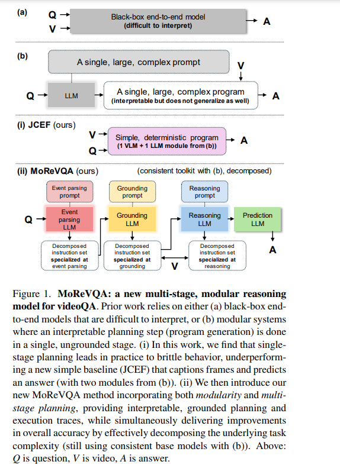

> Topic: \
> Long Video Understanding in the age of large MLMs \
> 
> Speaker: \
> Arsha Ngrani, Staff Research Scientist, Google Deepmind

# General Overview

Humans learn from Video and Audio. We continue to perceive the world via continuous video streams. But in ML we have fundamentally trained on images. This has lead to subpar knowledge representations in Deep models.

LLMs are exploding, and still it is not able to give comparable performance to brain (which has only 86B neurons)

Can we use text-heavy models to solve video problems?
- Well, its hard to efficiently train on video.
- However, Many LLMs are now adding video tokens as well (eg. Gemini)

But here's the challenge:
- There is a domain gap since LLMs are text-heavy
- We would like to avoid biases (noun bias, language bias, etc.) inherent to LLMs

In fact we need new tasks and evaluation strategies for video related tasks.

## Contents of the Talk

**Part-1:** We need new tasks, evaluations to TEST video properly
- **(A)** The AutoAD Family: Audio Descriptions for Movies (CVPR '23, ICCV '23, CVPR '24, ACCV '24)
- **(B)** The Neptune Dataset (arXiv '24)

**Part-2:** Focus on efficiency, leverage agentic structures
- **(A)** MoReVQA: Using LLMs in agentic sytems (CVPR '24)
- **(B)** MoNE: Compute Aware Adaptive Token Processing (NeuroIPS '24)

# Part-1A

Audio Descriptions for a video is really helpful in adding context information to the otherwise silent videos.
Following papers address the generation of quality AD from several sources:

### 1. [CVPR '23 | AutoAD: Movie Description in Context](https://arxiv.org/pdf/2303.16899)

What is AD and how is it different from Audio/Video Captioning
- Dense descriptions over time.
- Complementary to the raw audio track
- Aims at story-telling: includes characters, names, emotions, actions.

Objective of the paper is "Automatic AD generation" – a model that takes continuous movie frames as input and outputs AD in text form. Specifically, we generate text given a temporal interval of an AD, and evaluate its quality by comparing with the ground-truth AD

PROBLEMS: Lack of suitable training data.

1. Paired image-text or video-text data that is available at scale, such as alttext or stock footage with captions, does not generalize well to the movie domain.
2. For movie, we can also think of:
    - Human Annotations: costly and is not scalable
    - Movie scripts, books and plots: they do not ground on vision closely and are limited in number.

SOLUTION:

- Developing a model that uses temporal context together with a visually conditioned generative language model, while providing new and cleaner sources of training data.
- To achieve this, we leverage the strength of large-scale language models (LLMs), like GPT, and vision-language models, like CLIP, and integrate them into a video captioning pipeline that can be effectively trained with AD data.

### 2. [ICCV '23 | AutoAD II: The Sequel – Who, When, and What in Movie Audio Description](https://arxiv.org/pdf/2310.06838)

> For in acts we must take note of "who" did it, by "what" aids or instruments he did it (with), "what" he did, "where" he did it, "why" he did it, "how" and "when" he did it

To this end, we develop a new model for automatically generating movie AD, given CLIP visual features of the frames, the cast list, and the temporal locations of the speech; addressing all three of the ‘who’, ‘when’, and ‘what’ questions:
1. who – we introduce a character bank consisting of the character’s name, the actor that played the part, and a CLIP feature of their face, for the principal cast of each movie, and demonstrate how this can be used to improve naming in the generated AD
2. when – we investigate several models for determining whether an AD should be generated for a time interval or not, based on the visual content of the interval and its neighbours
3. what – we implement a new vision-language model for this task, that can ingest the proposals from the character bank, whilst conditioning on the visual features using crossattention, and demonstrate how this improves over previous architectures for AD text generation in an apples-to-apples comparison.

### 3. [ACCV '24 | AutoAD-Zero: A Training-Free Framework for Zero-Shot Audio Description](https://arxiv.org/pdf/2407.15850)

Our objective is to generate Audio Descriptions (ADs) for both movies and TV series in a training-free manner. We use the power of off-the-shelf Visual-Language Models (VLMs) and Large Language Models (LLMs), and develop visual and text prompting strategies for  this task.

Our contributions are three-fold:
1. We demonstrate that a VLM can successfully name and refer to characters if directly prompted with character information through visual indications without requiring any fine-tuning
2. A two-stage process is developed to generate ADs, with the first stage asking the VLM to comprehensively describe the video, followed by a second stage utilising a LLM to summarise dense textual information into one succinct AD sentence
3. A new  dataset for TV audio description is formulated. Our approach, named AutoAD-Zero, demonstrates outstanding performance (even competitive with some models fine-tuned on ground truth ADs) in AD generation for both movies and TV series, achieving state-of-the-art CRITIC scores.

# Part-1B 

[Neptune: The Long Orbit to Benchmarking Long Video Understanding](https://www.arxiv.org/pdf/2412.09582)

> This paper presents a dataset NEPTUNE and an open-ended LLM-based metric for evaluation called GEM

- This paper describes a semi-automatic pipeline to generate challenging questionanswer-decoy sets for understanding long videos.  Many existing video datasets and models are focused on short clips (10s-30s). While some long video datasets do exist, they can often be solved by powerful image models applied per frame (and often to very few frames) in a video, and are usually manually annotated at high cost.
- In order to mitigate both these problems:
    1. we propose a scalable dataset creation pipeline which leverages large models (VLMs and LLMs), to automatically generate dense, time-aligned video captions, as well as tough question answer decoy sets for video segments (up to 15 minutes in length). Our dataset Neptune covers a broad range of long video reasoning abilities and consists of a subset that emphasizes multimodal reasoning.
    2. Since existing metrics for open-ended question answering are either rule-based or may rely on proprietary models, we provide a new open source model-based metric (GEM) to score open-ended responses on Neptune.
- Benchmark evaluations reveal that most current open-source long video models perform poorly on Neptune, particularly on questions testing temporal ordering, counting and state changes. Through Neptune, we aim to spur the development of more advanced models capable of understanding long videos.

# Part-2A

[MoReVQA: Exploring Modular Reasoning Models for Video Question Answering](https://arxiv.org/pdf/2404.06511)

This paper addresses the task of video question answering (videoQA) via a decomposed multi-stage, modular reasoning framework.  Previous modular methods have shown promise with a single planning stage ungrounded in visual content. However, through a simple and effective baseline, we find that such systems can lead to brittle behavior in practice for  challenging videoQA settings. Thus, unlike traditional single-stage planning methods, we propose a multi-stage system consisting of an event parser, a grounding stage, and a final reasoning stage in conjunction with an external memory. All stages are training-free, and performed using few-shot prompting of large models, creating interpretable intermediate outputs at each stage. By decomposing the underlying planning and task complexity, our method, MoReVQA, improves over prior work on standard videoQA benchmarks (NExT-QA, iVQA, EgoSchema, ActivityNet-QA) with state-of-the-art results, and extensions to related tasks (grounded videoQA, paragraph captioning).

# Part-2B

[Mixture of Nested Experts: Adaptive Processing of Visual Tokens](https://arxiv.org/pdf/2407.19985)

- The visual medium (images and videos) naturally contains a large amount of information redundancy, thereby providing a great  opportunity for leveraging efficiency in processing.
- While Vision Transformer (ViT) based models scale effectively to large data regimes, they fail to capitalize on this inherent redundancy, leading to higher computational costs.
- Mixture of Experts (MoE) networks demonstrate scalability while maintaining same inference-time costs,  but they come with a larger parameter footprint.
- We present Mixture of Nested Experts (MoNE), which utilizes a nested structure for experts, wherein individual experts fall on an increasing compute-accuracy curve. Given a compute budget, MoNE learns to dynamically choose tokens in a priority order, and thus redundant tokens are processed through cheaper nested experts.
- Using this framework, we achieve equivalent performance as the baseline models, while reducing inference time compute by over two-fold.