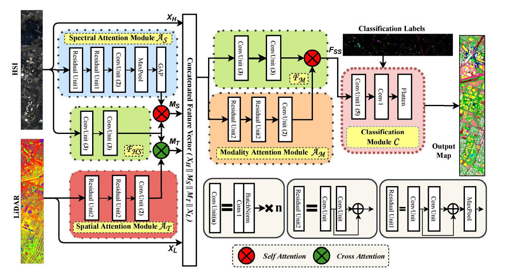

> Recent trends in AI for remote sensing image analysis
> by Proff. Biplav Banerjee, IIT Bombay

# About the field and prior work

Remote sensing uses hyperspectral data, as the input. It is different from RGB since it has channels corresponding to multiple frequencies of the spectrum (possible beyond VIBGYOR as well). This data (satellite imaging) can be used to detect various objects like road, buildings, or can also be used for change detection to estimate flood, landslides and air raids.

Traditionally following methods have been used in this field:

1. MLP (pixel as independent entities)
2. CNN-2D (considering spatial and spectral aspects as well)
3. Hybrd Architecture for HSI Classification that includes both Conv-2D and Conv-3D
4. ViT (uses separate spectral tokens and spatial tokens)
5. HSI and LIDAR Fusion

# Our Contribution in Remote Sensing

## 1. FusAtNet: Dual Attention based SpectroSpatial Multimodal Fusion Network for Hyperspectral and LiDAR Classification

[link to paper](https://openaccess.thecvf.com/content_CVPRW_2020/papers/w6/Mohla_FusAtNet_Dual_Attention_Based_SpectroSpatial_Multimodal_Fusion_Network_for_Hyperspectral_CVPRW_2020_paper.pdf)

- We can leverage multimodal data in Remote Sensing (RS) where many data types like multispectral imagery (MSI), hyperspectral imagery (HSI), LiDAR etc. are available.
- Effective fusion of these multisource datasets is becoming important
- However, fusion in the context of RS is non-trivial due to:
    1. Redundancy involved in the data and
    2. Large domain differences among multiple modalities
    3. Feature extraction modules for different modalities hardly interact among themselves, which further limits their semantic relatedness.

- We propose a feature fusion and extraction framework, namely FusAtNet, for collective land-cover classification of HSIs and LiDAR data:
    1. "HSI modality" is used to generate an attention map using “self-attention” that highlights its own "spectral features".
    2. “cross-attention” approach is simultaneously used to harness the "LiDAR derived" attention map that "accentuates the spatial features of HSI"

## 2. Coupled Feedback Network based HSI-LIDAR Fusion with Self Supervision

- Uses a DenseNet based architecture which has connections between high and low resolution branches.
- Self supervision is used
- Cross modal representations between spatial and hyperspectral domain.

## 3. GAFNet: Improving the Performance of Remote Sensing Image Fusion using Novel Global Self and Cross Attention Learning

