> Recent trends in AI for remote sensing image analysis
> by Proff. Biplav Banerjee, IIT Bombay

# About the field and prior work

Remote sensing uses hyperspectral data, as the input. It is different from RGB since it has channels corresponding to multiple frequencies of the spectrum (possible beyond VIBGYOR as well). This data (satellite imaging) can be used to detect various objects like road, buildings, or can also be used for change detection to estimate flood, landslides and air raids.

Traditionally following methods have been used in this field:

1. MLP (pixel as independent entities)
2. CNN-2D (considering spatial and spectral aspects as well)
3. Hybrd Architecture for HSI Classification that includes both Conv-2D and Conv-3D
4. ViT (uses separate spectral tokens and spatial tokens)
5. HSI and LIDAR Fusion

# Our Contribution in Remote Sensing

## 1. FusAtNet: Dual Attention based SpectroSpatial Multimodal Fusion Network for Hyperspectral and LiDAR Classification

[link to paper](https://openaccess.thecvf.com/content_CVPRW_2020/papers/w6/Mohla_FusAtNet_Dual_Attention_Based_SpectroSpatial_Multimodal_Fusion_Network_for_Hyperspectral_CVPRW_2020_paper.pdf)

- We can leverage multimodal data in Remote Sensing (RS) where many data types like multispectral imagery (MSI), hyperspectral imagery (HSI), LiDAR etc. are available.
- Effective fusion of these multisource datasets is becoming important
- However, fusion in the context of RS is non-trivial due to:
    1. Redundancy involved in the data and
    2. Large domain differences among multiple modalities
    3. Feature extraction modules for different modalities hardly interact among themselves, which further limits their semantic relatedness.

- We propose a feature fusion and extraction framework, namely FusAtNet, for collective land-cover classification of HSIs and LiDAR data:
    1. "HSI modality" is used to generate an attention map using “self-attention” that highlights its own "spectral features".
    2. “cross-attention” approach is simultaneously used to harness the "LiDAR derived" attention map that "accentuates the spatial features of HSI"

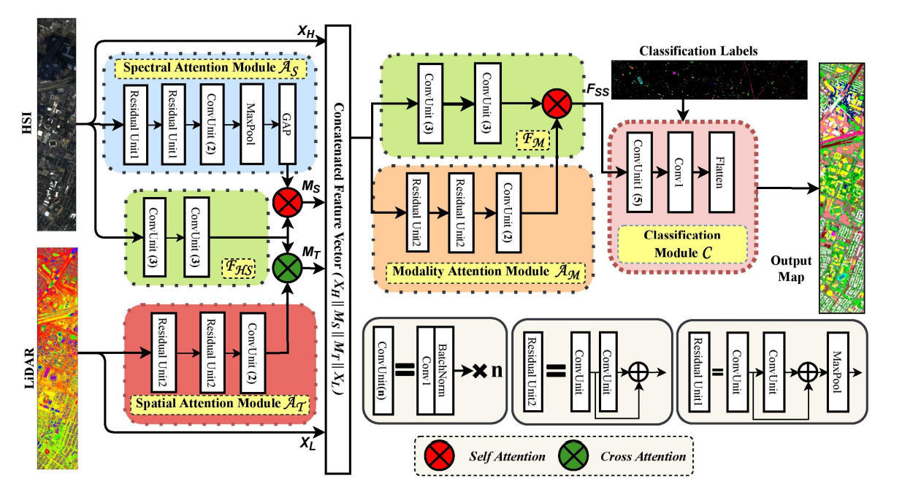

## 2. Coupled Feedback Network based HSI-LIDAR Fusion with Self Supervision

[link to a similar paper by same author(s)](https://www.sciencedirect.com/science/article/abs/pii/S0893608023002058)
- Uses a DenseNet based architecture which has connections between high and low resolution branches.
- Self supervision is used
- Cross modal representations between spatial and hyperspectral domain.

## 3. GAFNet: Improving the Performance of Remote Sensing Image Fusion using Novel Global Self and Cross Attention Learning

[link to paper](https://openaccess.thecvf.com/content/WACV2023/papers/Jha_GAF-Net_Improving_the_Performance_of_Remote_Sensing_Image_Fusion_Using_WACV_2023_paper.pdf)

PROBLEMS WITH EARLIER APPROACH:
- while the selfattention models fail to incorporate the global context due to the limited size of the receptive fields cross-attention learning may generate ambiguous features as the feature extractors for all the modalities are jointly trained.

PROPOSED SOLUTION:
- To address these issues, we propose a novel fusion architecture called Global Attention based Fusion Network (GAF-Net), equipped with novel self and cross-attention learning techniques.
- This is ViT based.
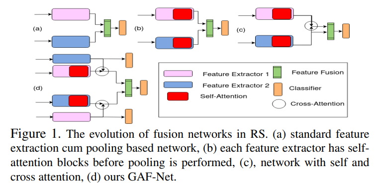

CONTRIBUTION:
- We design a simple and generic bi-modal fusion network for RS data called GAF-Net to learn discriminative and compact features through novel attention learning-based feature refinement in a principled manner.
- To our knowledge, we propose the first non-local spectralspatial self-attention learning module using key-value processing Besides, we introduce the novel paradigm of crossattention learning from auxiliary tasks. Finally, we propose
explicitly reducing redundancy between the modality features through a novel regularizer.
- We compare our attention modules with existing counterparts on a variety of datasets (visual, audio, and depth modalities), showing that the proposed global self-attention convincingly beats the models based on local operations

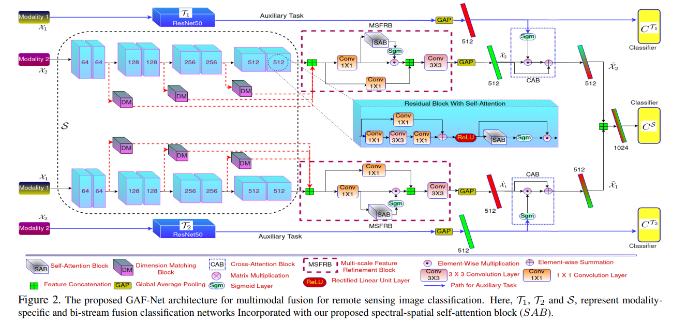

---

> An interesting way to see Residual Connections:
>   - KD (teacher-student model) -> distilling info from large network to a small network
>   - Self KD (model regularizations) -> distilling info from many neurons to maybe a few neurons (eg: during dropout)
>   - Self-KD within a Network -> distilling info from Layer1 + Layer2 + Layer3 into just Layer-1 if there is a residual connection between L1-L2 to L2-L3

> There is some work in remote sensing where we use Instance Normalization to capture the intrinsic parameters of various sensors. This is particularly helpful if we want to combine datasets from differnt sensors to create a training set.

> [Good at captioning, bad at counting: Benchmarking GPT-4V on Earth observation data](https://arxiv.org/pdf/2401.17600) Large Vision-Language Models (VLMs) have demonstrated impressive performance on complex tasks involving visual input with natural language instructions. However, it remains unclear to what extent capabilities on natural images transfer to Earth observation (EO) data, which are predominantly satellite and aerial images less common in VLM training data. In this work, we propose a comprehensive benchmark to gauge the progress of VLMs toward being useful tools for EO data by assessing their abilities on scene understanding, localization and counting, and change detection tasks.

# Foundation Models (Vision Only Models)

## 1. Masked Auto Encoder (MAE) [link to paper](https://arxiv.org/pdf/2111.06377)

- Divide the image into patches.
- Masking about 75% patches
- Positional Encoding should also be present for the patches.
- MAE encoder (ViT based) generates embeddings for the patches.
- MAE decoder tries reconstructs the original image. MSE Loss is applied as objective function.

    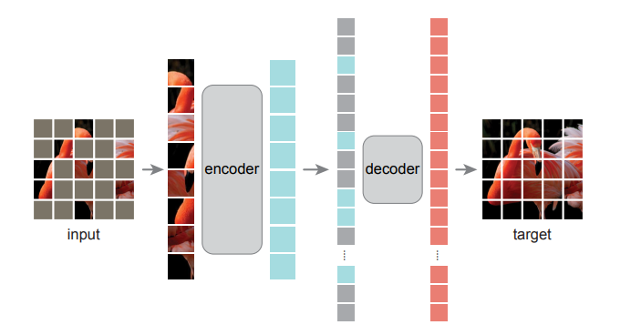

## 2. SAT MAE [link to paper](https://arxiv.org/pdf/2207.08051)

Developing unsupervised techniques for satellite imagery presents significant opportunities as unlabelled data is plentiful and the inherent temporal and multi-spectral structure provides avenues to further improve existing pre-training strategies. In this paper, we present SatMAE, a pre-training framework for temporal or multi-spectral satellite imagery based on Masked Autoencoder (MAE). 

1. To leverage temporal/spectral information, we include a temporal embedding
2. Independently masking image patches across temporal/spectral dimension. (There are actually 2 ways of masking: (i) constant/unified masking in which all samples in a batch are masked at same regions. (ii) Choice of region to mask is independent for each sample image in a batch)
3.  In addition, we demonstrate that encoding multi-spectral data as groups of bands with distinct spectral positional encodings is beneficial. (NOTE: Satellite imagery can be best represented as MS data with many bands (say C = 13) instead of the 3 channel RGB)

    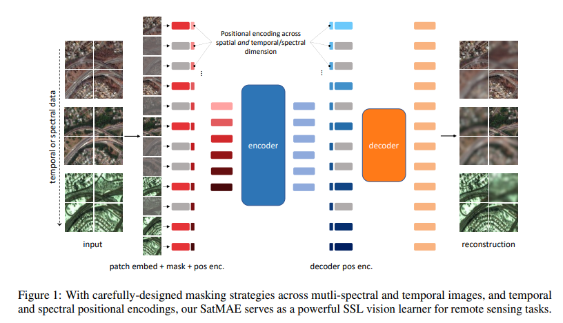

## 3. SAT MAE ++ [link to paper](https://arxiv.org/pdf/2403.05419)

> Limitations of SATMAE: Although SATMAE operates well on RGB and multi-spectral data, however
> 1. it does not exploit the multi-scale information present in the remote sensing data.
> 2. In addition, it struggles to generalize across domains having images at multiple scale levels.
> 3. Furthermore, ScaleMAE shows that the scale information can be encoded through a GSD based positional embeddings. However, the GSD based positional embeddings introduced by ScaleMAE can only be used with the RGB data that has same GSD resolution for each channel. Therefore, it is desired to rethink the design of the SatMAE framework to learn the multi-scale information that is not constrained to single data modality.

- Remote Sensing data is acquired from various sensor technologies and exhibit diverse range of scale variations as well as modalities.
- Existing satellite image pre-training methods either ignore the scale information present in the remote sensing imagery or restrict themselves to use only a single type of data modality.
- In this paper, we re-visit transformers pre-training and leverage multi-scale information (since MS data has C=13 channels and the resolution is not same) that is effectively utilized with multiple modalities.

    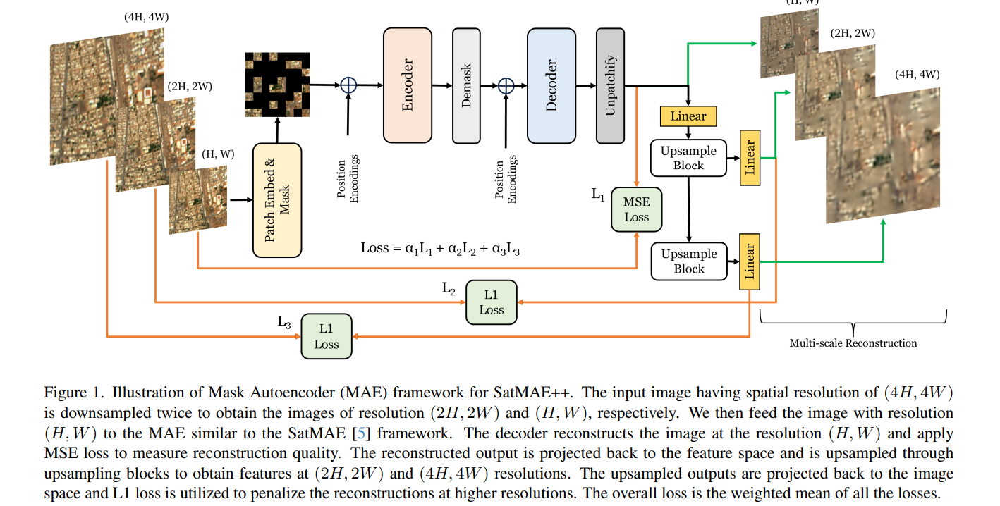

## 4. Spectral GPT [link to paper](https://arxiv.org/pdf/2311.07113)

- Trained on 3D data by masking the 3D Cube
- Uses "incremental learning": training on one dataset and then on other.
- To avoid "catastrophic forgetting" due to increamental learning, we use weight regularization.

> Side Reference:
> 1. [Paper on CROSSGRAD](https://arxiv.org/abs/1804.10745)
> 2. [Paper on Gradient Surgery](https://arxiv.org/pdf/2001.06782)

## 5. MM Earth [link to paper](https://arxiv.org/pdf/2405.02771v1)

- PROBLEM: The volume of unlabelled Earth observation (EO) data is huge, but many important applications lack labelled training data.
- MERIT THAT CAN BE EXPLOITED:  EO data offers the unique opportunity to pair data from different modalities and sensors automatically based on geographic location and time, at virtually no human labor cost.
- We seize this opportunity to:
    1. create a diverse multi-modal pretraining dataset at global scale.
    2. propose a Multi-Pretext Masked Autoencoder (MP-MAE) approach to learn general-purpose representations for optical satellite images.
- Our approach builds on the ConvNeXt V2 architecture, a fully convolutional masked autoencoder (MAE)

Here multi pretext means that, we reconstruct not only the image, but also other signals say depth-maps, segmentation-mask, etc.
    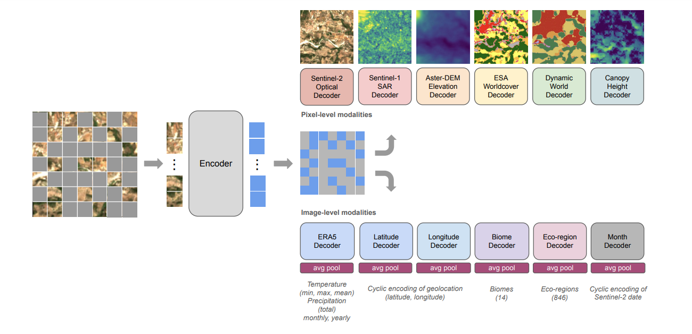

# Foundation Models (VLM based)

There can be many training strategies like:
1. Unsupervised pretraining & finetuning before prediction.
2. Supervised pretaining & finetuning before prediction.
3. VLM pretraining & zero-shot prediction

In VLMs, Nature of pretraining objectives can be: (1) Contrastive (2) Generative (3) Alignment

## 1. CLIP [link to paper](https://arxiv.org/pdf/2103.00020)

- They tried 1 leg, 2 leg, fused achitecture for Vision-Language branches. 2-leg was better.
- Used contrastive loss (NOTE: It can be of two types Self sup or Supervised) In this paper they used SupCon.

> Side Reference: [SupCon](https://arxiv.org/pdf/2004.11362)

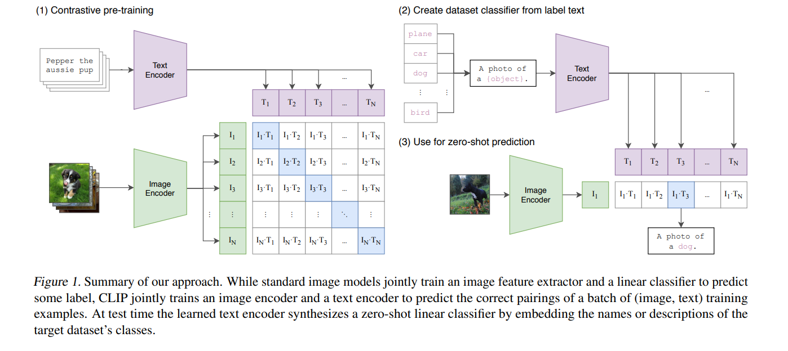

- In contrastive loss, 1 +ve case is Okay, but many -ve cases are needed, for better generalizations.
- Multiple +ve and -ve anchors are used in CLIP.
- 2 ways of anchors have been used.
    1. img is anchored, +/- comes from text.
    2. text is anchored, +/- comes from image.

## 2. Remote CLIP [link to paper](https://arxiv.org/pdf/2306.11029)

Personally, I believe this is a great paper that explains how to pretrain a foundation model whose architecture is promising, but the amnount of dataset in the field is limited.

### Architecture Search and Analysis on CLIP

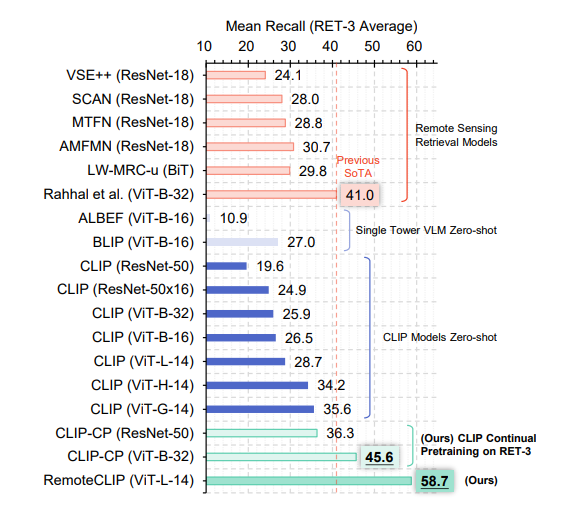

CLIP models do not have any special designs to optimize their performance in the remote sensing domain, and they have shown diverse zero-shot performance on remote sensing benchmarks.
1. Their zero-shot performances are poor. The performance of the largest CLIP (ViT-Large-14-336) is only 59.6% and 71.7% on EuroSAT and RESISC45 respectively. 
2. However, the [linear probing](https://arxiv.org/pdf/1610.01644) accuracy of CLIP reaches 98.1% and 94.9% on EuroSAT and RESISC45 in OpenAI’s evaluation, outperforming all other 11 compared foundation visual models. 

It shows that largescale contrastive image text pretraining produces high-quality visual representations that are suitable for the remote sensing domain, but at the same time, the cross-modal alignment property of such representations is unsatisfactory.

A comprehensive evaluation on RS Tasks revealed:
1. Larger CLIP models consistently perform good.
2. Continual pretraining on small CLIP further improves the performance.

However, as they kept on scaling up model size, performanace degraded due to overfitting on the limited RS image-caption data.

### Data Scaling via Annotation Unification

> Just see how they used bounding box, and segmentation datasets to generate image-text pairs using B2C and M2B strategies.

Three types of dataset were used:
1. Retrieval Data `RET-3`
    - Three major *image-text* datasets for remote sensing, i.e., RSICD, RSITMD, UCM, are directly adopted.
    - Captions of these datasets are annotated by humans

2. Detection Data `DET-10`
    - Combined six remote sensing datasets with *object-detection annotation*, including DOTA, DIOR, HRRSD, RSOD, LEVIR and HRSC. - - These datasets have a significantly higherresolution than RET-3 datasets (at least 800×600 vs. 224×224)
    - Translated via B2C (Bounding Box to Caption) Strategy

3. Segmentation Data `SEG-4`
    - Four popular remote sensing *semantic-segmentation* datasets, including Vaihingen, Postdam, iSAID, and LoveDA,
    - Translated via M2B (Mask to Bounding Box) then B2C (Bounding Box to Caption) strategies.

---

Some potential limitations of CLIP based models:

1. Do not perform good on Abstract or Systematic Tasks.
2. Zero-shot CLIP underperforms on fine-grained classification tasks.
3. Sensitive to Working or Prompt.

So there is some line of research regarding Prompt learning on CLIP:
- Context Optimization (CoOp)
- Conditional Context Optimization (CoCoOp)
- Multi-modal Prompting Learning (MaPLe)
- Visual Attention Parameterized Prompts Learning Network (APPLeNet) | IIT-Bombay
- C-SAW | SOTA in remote sensing | by IIT-Bombay

---

## 3. CoOp [link to paper](https://arxiv.org/pdf/2109.01134)

- Instead of relying on good quality prompts (which needs manual expertise), we can concat a learned context embedding along with `<CLASS>` of that image.
- Evaluation shows that this method yields good one-shot and few-shot performance

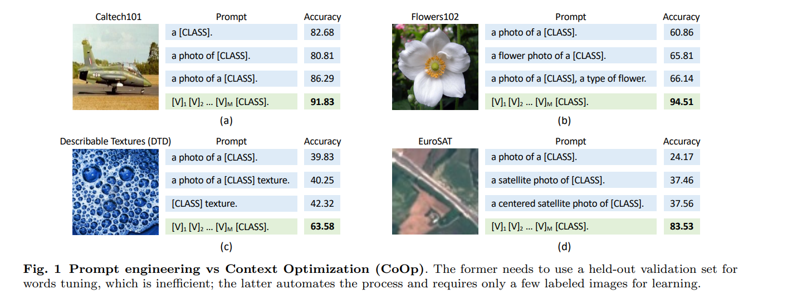

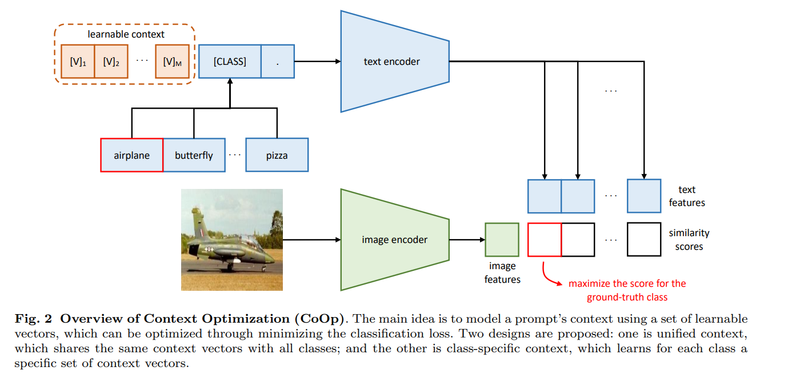

## 4. CoCoOp [link to paper](https://arxiv.org/pdf/2203.05557)

- In this study authors have identified a critical problem of CoOp: the learned context is not generalizable to wider unseen classes within the same dataset, suggesting that CoOp overfits base classes observed during training.
- To address the problem, they propose Conditional Context Optimization (CoCoOp), which extends CoOp by further learning a lightweight neural network to generate for each image an input-conditional token (vector).
- Compared to CoOp’s static prompts, CoCoOp's dynamic prompts adapt to each instance and are thus less sensitive to class shift.

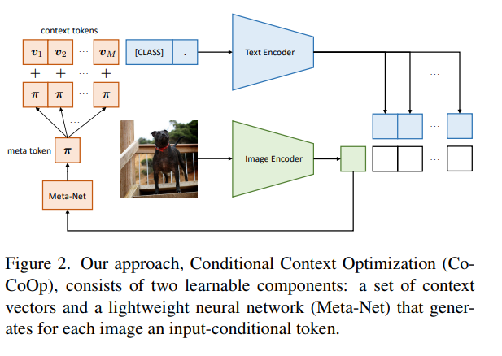

## 5. MaPLe [link to paper](https://arxiv.org/pdf/2210.03117)

- Using prompting to adapt representations in a single branch of CLIP (language or vision) is sub-optimal since it does not allow the flexibility to dynamically adjust both representation spaces on a downstream task.
- The paper proposes Multi-modal Prompt Learning (MaPLe) for "both" vision and language branches to improve alignment between the vision and language representations. This design promotes strong coupling between the vision-language prompts to ensure mutual synergy and discourages learning independent uni-modal solutions.

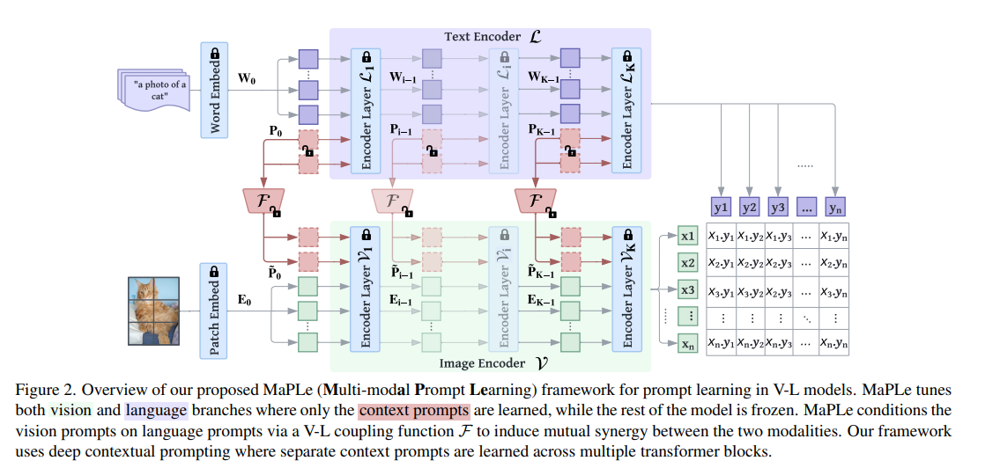

## 6. APPLe-Net [link to paper](https://arxiv.org/pdf/2304.05995)

- Novel image-conditioned prompt learning strategy called the Visual Attention Parameterized Prompts Learning Network (APPLeNet).
    1. Emphasizes the importance of multi-scale feature learning in RS scene classification, and
    2. Disentangles visual style and content primitives for domain generalization tasks.
- It does the above using the following strategy:
    1. Extracts visual content features from different layers of the Visual Encoder; and obtains Style properties from feature statistics of domain-specific batches. An attention-driven injection module is further introduced to generate visual tokens from this combined (visual content + style properties) information.
    2. Introduces an anticorrelation regularizer to ensure discrimination among the token embeddings, as this visual information is combined with the textual tokens.

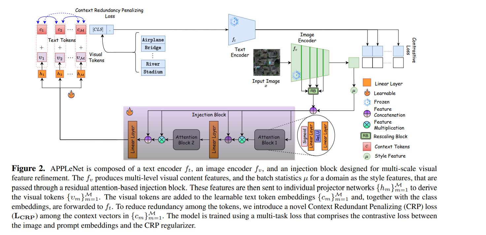

## 7. C-SAW [link to paper](https://arxiv.org/pdf/2311.15812)

> This paper can be viewed as a literature survey on domain-generalization tasks, and give some work-around in such tasks.

- CLIP’s vision encoder struggles to identify contextual image information, particularly when image patches are jumbled up.
- This issue is especially severe in optical remote sensing images, where land-cover classes exhibit well-defined contextual appearances.
- C-SAW complements CLIP with a self-supervised loss in the visual space and presents a novel prompt learning technique that emphasizes both visual domain and content specific features.
- CLIP backbone is kept frozen, and a small set of projectors are introduced for both (vis, txt) the CLIP encoders to train C-SAW
contrastively.

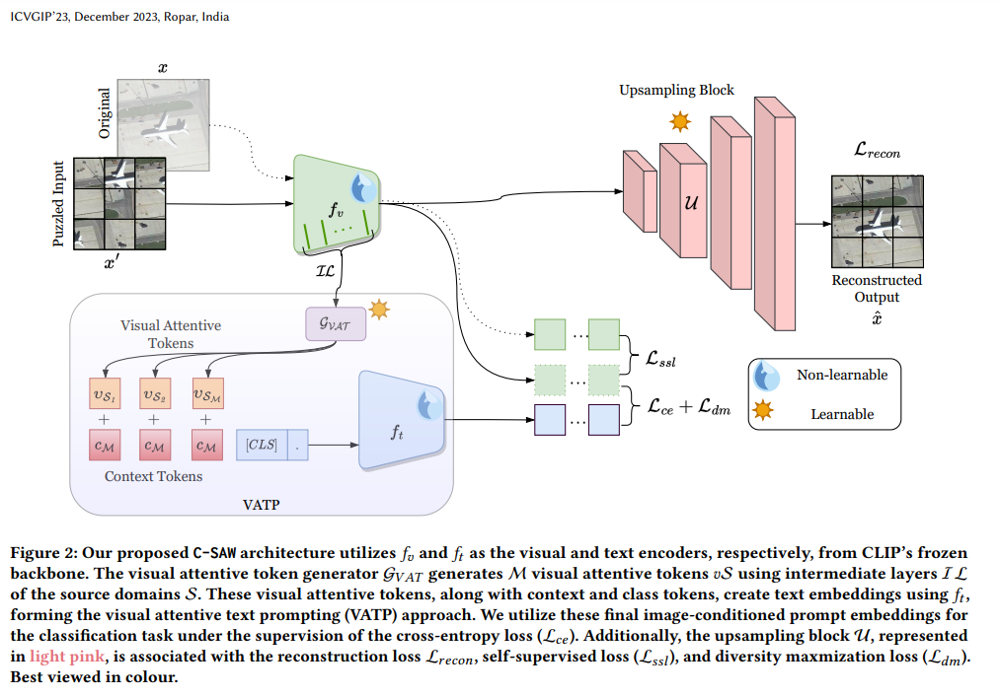

